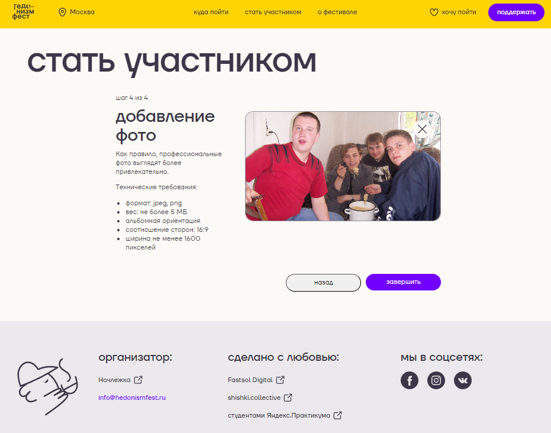

## ГедонизмФест
___
### 🍷 Cсылки:

* [Деплой проекта](https://andrey-grishkov.github.io/gedonizm-fest/)
* [Макет](https://www.figma.com/file/c3aY4aPf79ICMTqoC4AKLo/%D0%9D%D0%BE%D1%87%D0%BB%D0%B5%D0%B6%D0%BA%D0%B0-(Polished)?type=design&node-id=1990-8993&mode=design&t=63Z1nrqxJtVicqFe-0)
* [Бриф](https://www.notion.so/praktikum/e00621ea66de465ca2e38149bb322ab4)

___

### 🍇 О проекте ГедонизмФест

ГедонизмФест — благотворительный фестиваль, проходящий неделю в различных городах России.
В рамках фестиваля можно посетить интересные мероприятия, попить кофе в любимых заведениях, послушать лекцию,
поучавствовать в мастер-классе и т.д. Вся выручка от фестиваля перечесляется в пользу бездомных.
Организатор фестиваля негосударственная благотворительная организация "Ночлежка", занимающаяся помощью бездомным людям. Существует 30 лет.
С 2014 года Ночлежка провела 15 акций Эспресс-помощи, за которые собрала 5 744 522 руб.
Фестиваль уже не умещается в привычные рамки и превратился из однодневной акции в целый недельный ГедонизмФест.


*Главная страница*

ГедонизмФест - это про помощь, про наслаждение жизнью. 🦥
Это пространство, где можно выбрать и посетить мероприятия и выручка уйдет в помощь бездомных людей. 🏠
Это пространство, где можно стать участником в благотворительности для нуждающихся людей. 🤸
Это пространство, где можно поддержать проект, тем самым помогая нуждающимся. 👍
___

### 🐿️ О работе над созданием сайта для фестиваля ГедонизмФест

В рамках обучения в Яндекс Практикум по специальности "Веб разработчик+" студенты разбиваются
на группы для отработки полученных навыков разработки и получения навыков командной работы
в рамках создания сайта фестиваля под руководством опытного тимлидера.


*Форма для участников фестиваля*

Для студентов создается имитация реального рабочего проекта. Тимлидер организовывает команду, структурирует проект,
распределяет задачи между участниками, в зависимости от их возможностей, ведет Kanban-доску, устраивает созвоны,
консультирует по всем техническим вопросам, проводит ревью пулл реквестов участников, проводит слияния веток и решает
конфликты, поддерживает в команде мотивацию и доверительные отношения. 🌞
Для помощи тимлидерам всех команд выделяется наставник по вопросам технического характера
и Project Manager по организационным вопросам.

___

### 👨‍👨‍👦‍👦 Команда проекта

__Наставник__: [Алексей Мартынов](https://github.com/FenixDeveloper) 🏇
__Project Manager__: Юлия Сметанина 🏌🏻
__Team Leader__: [Андрей Гришков](https://github.com/Andrey-Grishkov) 🏋🏼‍♂️

#### Команда разработчиков:
[Тяжеломов Андрей](https://github.com/tyazhelomov) 🏃
[Роман Маскаев](https://github.com/polpotcamp) 🤺
[Екатерина Турова](https://github.com/turovaes) 🤸🏻‍♀️
[Игорь Извольский](https://github.com/Izvolsky) 🚴‍♀️
[Дмитрий Валентинов](https://github.com/ValentinovDmitrii) ⛹🏽‍♂️

___

### 🏸Технологии
*Html, SCSS, BEM, Perfect Pixel, Git, Webpack, JavaScript*


___
### 🥊 Реализованные функции:
* Структурирован проект и использованы наименования в соответствии с методологией БЭМ.
* Выполнена верстка главной страницы. На главной странице присутствует лента событий. На малых разрешениях фотографии с
  мероприятий отображены в виде слайдера.
* В шапке сайта присутствует навигация по страницам сайта. Выполнено
  выпадающее меню выбора города, с сохранением выбора для дальнейшего использования.
  Сверстаны попапы по нажатию на кнопку "Хочу пойти", где отображаются сохраненные пользователем мероприятия,
  и попап по нажатию на кнопку "поддержать", при сабмите которого появляется баннер оповещения на главной странице.
* В ленте карточек на главной странице при нажатии на карточку появляется попап с подробной информацией о мероприятии.
  При нажатии на кнопку лайка карточки, мероприятие добавляется в список "Хочу пойти" и будет отображена в соответствующем попапе.
  В самом попапе карточки можно открыть попап для покупки билета на мероприятие (при покупке аналогично появляется банер
  оповещения на главной странице) и попап с выбранными мероприятиями.


*Попап карточки мероприятия*

* Сверстана страница "о фестивале" с кнопкой позволяющей плавно вернуться к началу страницы.
* Для попапов реализовано закрытие по оверлею, по кнопке Esc и невозможность прокрутки контента страницы при открытом попапе.
* Частично выполнена страница с отметкой мест проведения мероприятий на карте. Выполнены фильтр-тэги, при нажатии на
  фильтр-тэг "все" - остальные ранее выбранные фильтр-тэги становятся неактивными и наоборот.
* Реализована страница с формой для участия в фестивале. Форма выполнена на одной странице с последовательным открытием
  следующих пунктов, в зависимости от ранее сделанного выбора. В форме доступно загрузка фотографии.
  По сабмиту формы реализована имитация отправки данных на бэкенд (в консоль выводиться массив выбранных данных), а также аналогично
  появляется баннер оповещения на главной странице.
* Выполнена страница для разработчиков с ui-kit, откуда можно брать основные элементы сайта
  [ссылка на ui-kit](https://andrey-grishkov.github.io/gedonizm-fest/ui-kit.html)
* Частично реализована адаптивная верстка Perfect Pixel по макету.
* Применена методология ООП.

___

### 🤼  Планы по развитию проекта:
* Исправить ряд выявленных багов в проекте и поработать с путями для корректной работы деплоя.
* Доделать функционал карты, включая метки на карте и весь список мероприятий в разных городах.
* Доделать адаптивность сайта и Perfect Pixel по макету, поработать с промежуточными разрешениями экрана.
* Сделать бургер меню в шапке сайта.
* Добавить валидацию форм.
* Реализовать back-end часть.
* Реализовать возможность оплаты.
___

### 🏂🏻 Инструкция по запуску на локальной машине:
* Установить [Node.js](https://nodejs.org/ru/)
* Клонировать репозиторий ``` git clone 'ссылка на репозиторий'```
* Установить зависимости ``` npm install ```
* Запустить приложение ``` npm run dev ```
